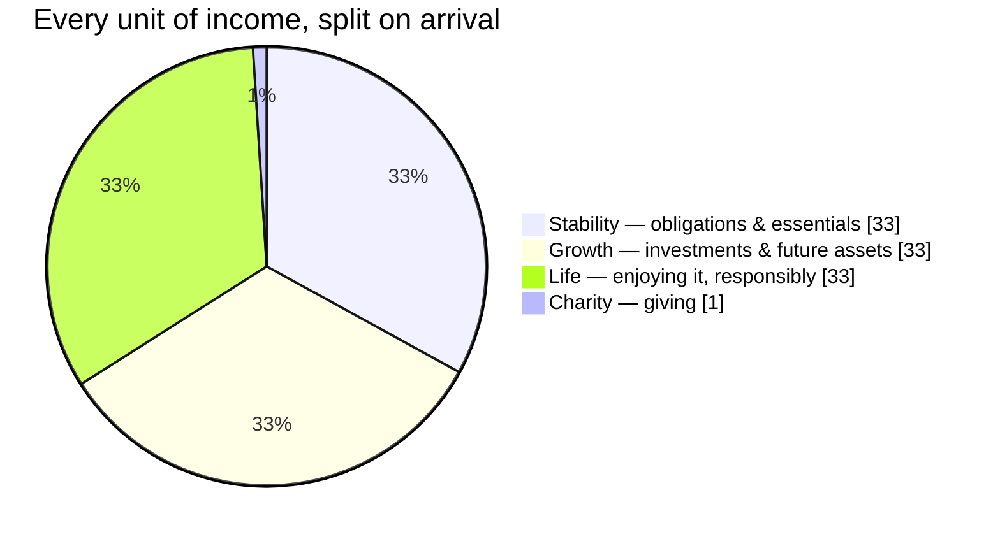
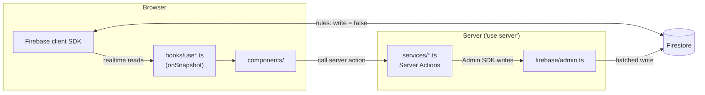

<div align="center">


# THULUTH — ثلث

**A personal financial operating system built around one fixed rule: 33 / 33 / 33 / 1.**

Every unit of income you earn is split automatically — no budgeting decisions, no spreadsheets,
no willpower required. You just track what happens after the split.

[**🚀 Live app — thuluth.albajawee.com**](https://thuluth.albajawee.com) · [Open issues](https://github.com/albajawee/THULUTH_PRODUCTION/issues) · [Report a bug](https://github.com/albajawee/THULUTH_PRODUCTION/issues/new)

[](https://github.com/albajawee/THULUTH_PRODUCTION/actions/workflows/ci.yml)
[](https://thuluth.albajawee.com)


[](https://github.com/albajawee/THULUTH_PRODUCTION/issues)

</div>

---

## Table of contents

- [Why THULUTH](#why-thuluth)
- [The methodology](#the-methodology)
- [Features](#features)
- [Tech stack](#tech-stack)
- [Architecture](#architecture)
- [Data model](#data-model)
- [Getting started](#getting-started)
- [Environment variables](#environment-variables)
- [Scripts](#scripts)
- [Project structure](#project-structure)
- [Internationalization](#internationalization)
- [Progressive Web App](#progressive-web-app)
- [Security model](#security-model)
- [Contributing](#contributing)
- [License](#license)

---

## Why THULUTH

Most budgeting apps ask you to categorize spending after the fact, or plan a budget you'll abandon
in three weeks. THULUTH inverts that: the split happens **the moment income arrives**, before you
can rationalize it away. What's left to think about is simple — *did I stay inside each fund's
share?*

**ثلث** (*thuluth*) is Arabic for "one third" — the app is bilingual EN/AR with full RTL support
from day one, not bolted on later.

## The methodology



| Fund | Share | Purpose |
|---|---|---|
| 🔵 **Stability** (الاستقرار) | 33% | Rent, loans, utilities, groceries — the obligations that don't move |
| 🟢 **Growth** (النمو) | 33% | Investments, real estate, business, retirement |
| 🟣 **Life** (الحياة) | 33% | Travel, restaurants, entertainment, gifts — spent without guilt |
| 🟡 **Charity** (الصدقة) | 1% | Donations, tracked with the same rigor as every other dollar |

> Shares total **1.00** (0.33 × 3 + 0.01). Distribution floors to the nearest currency unit per
> fund, by design — see `DISTRIBUTION` in `src/lib/constants/fund-percentages.ts`.

From there, you record **expenses** against each fund, **transfer** between funds when life
happens, log **donations** out of the charity fund, set fund-linked savings **goals**, and read
**reports** — every mutation lands in an immutable transaction ledger and audit log, never a
silent update.

## Features

- 💰 **Automatic income distribution** — one input, four funds updated atomically
- 🧾 **Per-fund expense tracking** with categories, history, and refunds
- 🔁 **Inter-fund transfers** with a reason, logged like everything else
- 🎯 **Savings goals** linked to a fund — progress is derived from the real balance, never a
  separate number that can drift
- 🤲 **Charity/donations** tracking, recipient optional
- 📊 **Reports** — savings rate, fund utilization, top categories, period-over-period comparison
- 🌗 **Dark-mode-only** UI built on shadcn/ui + Tailwind v4
- 🌍 **Full EN/AR bilingual + RTL** — enforced in CI (see [i18n](#internationalization))
- 📱 **Installable PWA** — offline fallback, update notifications, works on Android/iOS/Windows/desktop
- 🔒 **Server-verified auth** — every write is gated by a real session, never a client-supplied user id

## Tech stack

| Layer | Choice |
|---|---|
| Framework | **Next.js 16.2** (App Router), **React 19.2** — ⚠️ see [Getting started](#getting-started), this build has real breaking changes vs. stock Next |
| Language | **TypeScript**, strict |
| Styling | **Tailwind CSS v4**, **shadcn/ui** on **@base-ui/react** (not Radix), **lucide-react**, **framer-motion** |
| Data | **Firebase** — client SDK (Auth + realtime Firestore) *and* **firebase-admin** (privileged server writes) |
| i18n | **next-intl** — English + Arabic, RTL, locale in a cookie |
| Forms | **react-hook-form** + **zod** |
| Charts | **recharts** |
| Notifications | **sonner** |
| Theme | **next-themes** (dark-only; system theme disabled on purpose) |

## Architecture

The one rule that matters: **reads are client-side and realtime; writes are server-side and
privileged.** No component ever writes to Firestore directly — Firestore rules forbid it outright.



Every write in `services/*.ts` runs inside a single `adminDb.batch()` that atomically: writes the
primary doc → increments the affected fund balance(s) → appends an immutable transaction record →
appends an audit log entry → commits → `revalidatePath`s the affected routes. No partial writes,
ever.

## Data model

All data lives per-user under Firestore, enforced by `firestore.rules` (client **read-only**,
every write path goes through a Server Action):

```
users/{userId}
  ├─ funds/{fundId}       stability | growth | life | charity — { balance, totalReceived, totalSpent }
  ├─ incomes/{id}         { amount, source, date, distributions, ... }
  ├─ expenses/{id}
  ├─ goals/{id}           { title, targetAmount, fundType, deadline, priority, status }
  ├─ transfers/{id}       { fromFund, toFund, amount, reason }
  ├─ donations/{id}
  ├─ transactions/{id}    IMMUTABLE ledger — every balance change, ever
  └─ audit_logs/{id}      IMMUTABLE — who did what, when
```

## Getting started

> **Before writing any Next.js code:** this project runs a modified Next.js build with real
> breaking changes vs. the public docs and most training data. Read `AGENTS.md` and the relevant
> guide under `node_modules/next/dist/docs/` first — it will save you a confusing debugging
> session.

**Prerequisites:** Node **22.x** (see `engines` in `package.json`), a Firebase project (Firestore +
Authentication enabled), and the [Firebase CLI](https://firebase.google.com/docs/cli) if you want
to deploy rules/indexes yourself.

```bash
git clone https://github.com/albajawee/THULUTH_PRODUCTION.git
cd THULUTH_PRODUCTION
npm install

cp .env.local.example .env.local
# fill in your Firebase client + admin credentials — see below

npm run dev
```

Open [http://localhost:3000](http://localhost:3000). The root route redirects to `/dashboard`,
which redirects to `/login` if you're not authenticated yet — register an account to get started;
`initFunds` bootstraps the four funds at zero balance on first sign-in.

## Environment variables

Copy `.env.local.example` → `.env.local` and fill in your own Firebase project's values:

| Variable | Used by | Notes |
|---|---|---|
| `NEXT_PUBLIC_FIREBASE_API_KEY` | Client SDK | Safe to expose — Firebase client keys are not secrets |
| `NEXT_PUBLIC_FIREBASE_AUTH_DOMAIN` | Client SDK | |
| `NEXT_PUBLIC_FIREBASE_PROJECT_ID` | Client SDK | |
| `NEXT_PUBLIC_FIREBASE_STORAGE_BUCKET` | Client SDK | |
| `NEXT_PUBLIC_FIREBASE_MESSAGING_SENDER_ID` | Client SDK | |
| `NEXT_PUBLIC_FIREBASE_APP_ID` | Client SDK | |
| `FIREBASE_ADMIN_PROJECT_ID` | Admin SDK (server-only) | From a service account |
| `FIREBASE_ADMIN_CLIENT_EMAIL` | Admin SDK (server-only) | **Keep secret** |
| `FIREBASE_ADMIN_PRIVATE_KEY` | Admin SDK (server-only) | **Keep secret** — never commit |

> The CI workflow (`.github/workflows/ci.yml`) needs these same nine values as **repository
> secrets** to get past the `Build` step — `next build` imports `firebase-admin`, which
> initializes at module load. If you fork this repo, add them under *Settings → Secrets and
> variables → Actions* before expecting a green check.

## Scripts

| Command | Does |
|---|---|
| `npm run dev` | Start the dev server (Turbopack) |
| `npm run build` | Production build |
| `npm run start` | Serve the production build |
| `npm run typecheck` | `tsc --noEmit` |
| `npm run lint` | ESLint over `src/` |
| `npm run check` | typecheck → lint → build, in order — run this before opening a PR |
| `npm run generate:icons` | Regenerate `public/icon-*.png` from `scripts/generate-pwa-icons.mjs` |

## Project structure

```
src/
├─ app/                  Next.js App Router
│  ├─ (auth)/            login, register — own minimal layout
│  ├─ (dashboard)/       dashboard, funds/*, income, goals, transfers, reports, settings
│  ├─ manifest.ts        PWA web app manifest
│  └─ offline/           PWA offline fallback
├─ components/
│  ├─ ui/                shadcn primitives (@base-ui/react)
│  ├─ layout/             DashboardShell, Sidebar, TopBar, BottomNav
│  ├─ pwa/                install prompt, service worker registrar, update flow
│  └─ {dashboard,funds,income,goals,charity}/   feature components
├─ lib/
│  ├─ types/             domain types
│  ├─ constants/         fund percentages, config, categories
│  ├─ utils/             calculations, formatters, zod validators
│  ├─ repositories/      client-side Firestore reads
│  ├─ services/          'use server' — the only place that writes
│  ├─ auth/              session verification (requireUser gate)
│  └─ hooks/             realtime subscriptions + context providers
└─ messages/             en.json / ar.json — next-intl, parity enforced in CI
```

## Internationalization

`src/messages/en.json` and `ar.json` must carry the **same key set** — a missing key ships a raw
translation key to a real user, so it's a CI-blocking check
(`.github/workflows/ci.yml` → `i18n-parity`), not a lint warning. If you add a string, add it to
both files in the same PR.

## Progressive Web App

THULUTH installs like a native app — manifest, service worker, offline fallback, install prompt,
and an update-available flow (see `public/sw.js` and `src/components/pwa/`). The service worker is
scoped deliberately narrowly: it only ever intercepts same-origin `GET` requests, and leaves
Server Actions, `/api/*`, and Firestore's own realtime traffic completely untouched.

## Security model

Every Server Action calls `requireUser()` (`src/lib/auth/session.ts`), which verifies the
`__session` cookie against Firebase Admin and derives the user **from the verified session** —
never from an argument the client passed in. Combine that with Firestore rules that make every
subcollection client-**read**-only, and there is exactly one path to writing money data: through a
Server Action, for the session's own user, atomically.

## Contributing

This is a young, actively-developed project and outside contributions are genuinely welcome — pick
an [open issue](https://github.com/albajawee/THULUTH_PRODUCTION/issues), especially:

| Issue | Good for |
|---|---|
| [#8 — Design a real logo/brand mark](https://github.com/albajawee/THULUTH_PRODUCTION/issues/8) | Designers — everything today is a text wordmark or a placeholder icon |
| [#7 — Password reset + Google sign-in](https://github.com/albajawee/THULUTH_PRODUCTION/issues/7) | Firebase Auth experience |
| [#5 — Remove unused variable](https://github.com/albajawee/THULUTH_PRODUCTION/issues/5) | First-time contributors, a genuinely 5-minute fix |
| [#4 — Fix react-hooks lint warnings](https://github.com/albajawee/THULUTH_PRODUCTION/issues/4) | React/hooks familiarity |
| [#6 — Verify the PWA install flow on real devices](https://github.com/albajawee/THULUTH_PRODUCTION/issues/6) | Anyone with an Android/iOS/Windows device to test on |
| [#3 — Web Push notifications](https://github.com/albajawee/THULUTH_PRODUCTION/issues/3) | A meatier feature, VAPID + Server Actions |

**Before opening a PR:**

1. Read `AGENTS.md` — this Next.js build has real breaking changes from what you'd expect.
2. `npm run check` locally (typecheck + lint + build) — CI runs the same gate, plus the i18n
   parity check.
3. Keep writes atomic and server-side — see [Security model](#security-model). Never add a
   Server Action that accepts a `userId` parameter from the caller.
4. If you touch any user-facing string, update **both** `en.json` and `ar.json`.

No formal `CONTRIBUTING.md` yet, no CLA, no ceremony — open a PR against `main` and it'll get a
real review.

## License

No license has been chosen for this repository yet. Until one is added, all rights are reserved by
default — reach out via an issue if you want to use this beyond contributing back.

